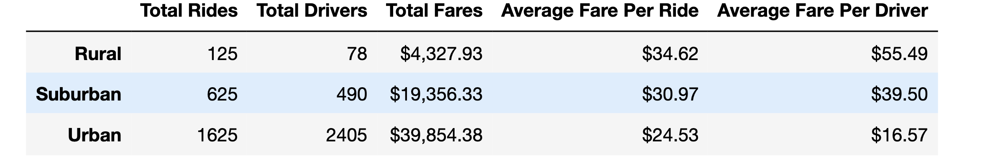
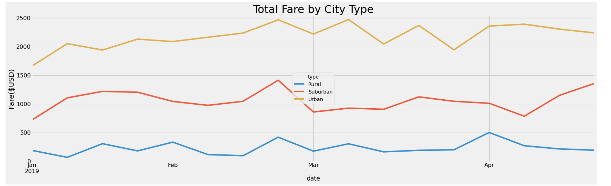

# PyBer_Analysis

## Overview of the analysis
The goal of this analysis is to:
    1. Create a summary DataFrame of the ride-sharing data by city type;
    2. Create a multiple-line graph that shows the total weekly fares for each city type

There are three types of cities that play a part for this analysis: Rural, Suburban, and Urban. I'll be writing a report that summarizes how the data differes by city type and how those differences can be used by decision-makers at PyBer.

## Results

As shown in the summary dataframe, there is a positive correlation between the extent to which cities are urbanized/developed and the number of total rides, drivers, and fares. That is, it is very likely that there is a higher demand for ride-sharing in a city with more infrastructures that people may need a ride to get to. 

On the other hand, there is a negative correlation between cities' developed-ness and average fares. This trend makes sense since there are probably less drivers in rural areas and prices are higher where supply is low. 

From these line graphs in one grid, we can see how total fares by each city type go up and down over the period of 4 months. It seems that a lot of people tend to use the ride-sharing services at the end of February regardless of the city type. And generally speaking, there's a gradual decrease in numbers in March although it goes up relatively drastically in rural and urban cities at the end of the month. Unlike the other two city types' downward trend in April, however, we can see that there is an abrupt increase in numbers in suburban cities in the month of April. 

## Summary
First business recommendation we can come up with is perhaps to hire and allocate a little more drivers to suburban cities during the month of April since there is an increasing number in total fare. The CEO of PyBer could potentially bear profit from doing so. But we have to make sure he/she doesn't do the same for the other city types since rural and urban cities won't create as much of a profit since the graph shows that the total fare decreases.

Secone recommendation might be that he/she should consider taking advantage of the month of February. For some reason, people in all city types want to use the ride-sharing services during that time. Perhaps the company can air more advertising via TV, social media, or any popular platform so that people can access their service more readily. Another way to attract people to use the service is to make some sort of promotions during that time period. 

Lastly, maybe we can advise against providing the service in the rural cities since it doesn't bring too much profit to the company. Total fares for the rural cities are relatively very small compared to the suburban and urban ones. We can counsel them that they should perform an internal investigation to find out if it's actually worth it to have the service available.